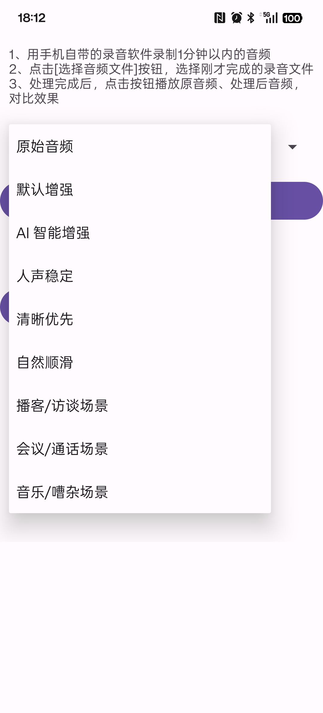
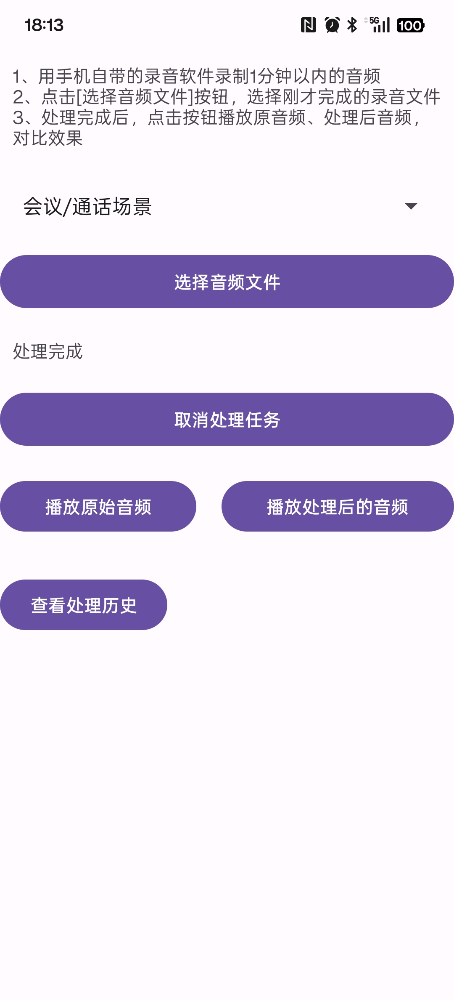
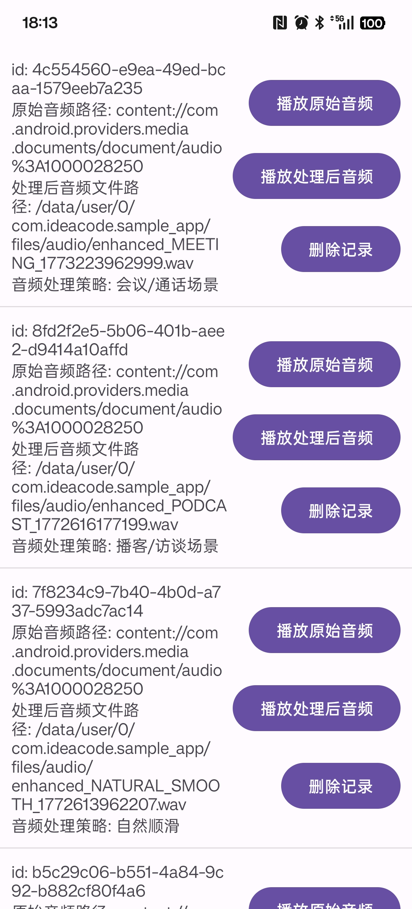

# Soundly

🎧 **Soundly** 是一个面向 Android 的轻量级音频处理 SDK，提供音频解码、分析、DSP 处理以及播放能力，帮助开发者快速构建高质量的音频处理应用。

Soundly 的设计目标是：**让复杂的音频处理流程变得简单、清晰、可扩展**。


一文了解 Soundly-SDK 运行机制：https://juejin.cn/post/7616666565057478671

---

## 📱 sample-app 运行截图
<p align="left">
  
  
  
  
</p >

## ✨ Features

- 🎧 **Audio Decode**  
  基于 Android `MediaCodec` 的音频解码能力

- 🧠 **Audio Analyzer**  
  音频特征分析能力，用于识别音频特征信息

- 🎚 **DSP Processing Pipeline**  
  模块化 DSP 处理管线

- 🔊 **PCM Data Processing**  
  完整的 PCM 数据处理流程

- 📀 **WAV Export**  
  支持音频处理结果导出为 WAV 文件

- ▶️ **Audio Player**  
  内置音频播放能力

- 📊 **Processing History**  
  支持音频处理历史记录

---


## 📦 Project Structure
soundly  
├─ soundly-core        # 核心音频处理能力  
├─ soundly-sdk         # 对外 SDK 接口  
└─ sample-app          # 示例应用  

模块职责：

| Module | Description |
|------|-------------|
| soundly-core | 音频解码、分析、DSP 处理 |
| soundly-sdk | 对外 API 接口 |
| sample-app | 示例 App |

---

## ⚡ Getting Started

### 1. Clone 项目

git clone https://github.com/andyliu900/Soundly.git

### 2 添加依赖

（1）如果通过 module 引入：

```gradle
dependencies {
    implementation(project(":soundly-sdk"))
}
```

（2）构建 aar ，通过 aar 进行引入：
如果是希望通过 aar 方式进行引入，需要按照以下步骤进行集成

在 app 层根目录新增 libs 文件夹

运行 gradle 脚本，生成 aar 文件
```Gradle
./gradle publishReleasePublicationToMyRepoRepository
```
生成的 aar 文件会存放在根目录 /repo 目录下，将 aar 文件复制到 libs 目录下

app 层 gradle 配置增加以下内容
由于脚本构建的 aar 包不会携带第三方组件，需要在 app 层的 gradle 配置增加 room、timber 配置
```Gradle
    // 使用 aar 形式需要配套增加 room、timber 组件
    implementation(files("libs/soundly-sdk-1.0.6.aar"))
    implementation(libs.room.runtime)
    implementation(libs.room.ktx)
    kapt(libs.room.compiler)
    implementation(libs.timber)
```

### 3 初始化SDK

```kotlin
class App : Application() {
    override fun onCreate() {
        super.onCreate()
        Soundly.init(this)
    }
}
```

### 4 处理音频

```kotlin
Soundly.container().sdkAudioProcessor.process(
    uri = uri,
    presetOption = _presetOption.value,
    outputFileName = "enhanced_${_presetOption.value}_${System.currentTimeMillis()}"
) { process ->
    _uiState.value = _uiState.value.copy(
        stage = process.stage,
        process = process.percent,
        message = process.message,
        wavFilePath = process.wavFilePath
    )
}
```

## 📖 Example Workflow
Soundly 的处理流程如下：

```agsl
Audio File
↓
MediaCodec Decoder
↓
Audio Analyzer
↓
DSP Pipeline
↓
Audio Processor
↓
Output (Wav / Player)
```

## 📱 Sample App
项目提供 sample-app 用于演示完整功能：  
功能包括：  
- 音频导入
- 音频处理
- 处理历史记录
- 音频播放

## 🛠 Tech Stack
- Kotlin
- Android MediaCodec
- Coroutine
- DSP Audio Processing
- Room (History Storage)

## 🤝 Contributing
欢迎提交 Issue 或 Pull Request 来帮助改进 Soundly。  

贡献方式：  
- Fork 本仓库  
- 创建 Feature 分支  
- 提交代码  
- 提交 Pull Request  

## ⭐ Support
如果这个项目对你有帮助，欢迎：  
- ⭐ Star 本仓库  
- 🐞 提交 Issue  
- 🔧 提交 Pull Request  

你的支持将帮助项目持续改进。

